::: {.columns}
::: {.column width="80%"}
Quantum GIS (QGIS) is een Geografisch Informatie Systeem(GIS) om te kunnen werken met kaarten en geografische informatie op de computer. Het is een open source tegenhanger voor ArcGIS Desktop van ESRI en gratis te gebruiken. QGIS is beschikbaar voor Windows, Mac en Linux. Met QGIS is een degelijk GIS-systeem voor iedereen beschikbaar.
:::

::: {.column width="20%"}
{width=100}
:::
:::

Dit artikel is bedoeld als praktische eerste kennismaking met QGIS, gericht op bos- en natuurbeheerders. Een snelle duik in QGIS om al doende te laten zien wat er mogelijk is met dit programma. Ik leg weinig uit maar probeer snel een indruk te geven van wat allemaal mogelijk is met dit veelzijdige programma.

Ik ga uit van een vrij goede internetverbinding.

## Downloaden en installeren
Het programma is te downloaden van de [website van QGIS](http://qgis.org/ "Website van QGIS"). Kies onder *download* de versie voor jouw systeem. Voor Windows is een *[Standalone Installer](http://hub.qgis.org/projects/quantum-gis/wiki/Download#1-Windows)* beschikbaar die het programma compleet installeert.
De huidige stabiele versie van QGIS is 1.8 'Lisboa'. Versie 2.0 wordt binnenkort verwacht. Voor deze introductie is QGIS 1.8 gebruikt.

## Eerste kennismaking
Start het programma op. Er verschijnt eerst een scherm met *Quantum GIS 1.8.0 Lisboa*, vervolgens verschijnt het programma. Voor mensen die eerder een GIS programma hebben gebruikt is het waarschijnlijk heel herkenbaar.
We gaan gelijk aan de slag.

## Basiskaarten toevoegen

### Luchtfoto van Nederland toevoegen
De overheid heeft via [PDOK](http://www.pdok.nl) verschillende kaarten gratis beschikbaar gemaakt. Ook een [luchtfoto van Nederland van 2009](https://www.pdok.nl/nl/service/wms-luchtfoto-pdok-achtergrond) <small>(lees daar ook de metadata, voor commercieel gebruik is een licentie nodig)</small>. Ga naar de voorgaande link op internet. Op deze pagina staan de gegevens over deze service en waar QGIS die kan vinden. Kopieer de **Service URL**.

Ga terug naar QGIS. In bovenste werkbalk zie je verschillende icoontjes met plusjes. Hiermee kunnen kaarten toegevoegd worden.  Klik op 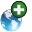 (WMS-laag Toevoegen).  In het volgende scherm klik je op *Nieuw*. Vul bij *Naam* bijvoorbeeld 'PDOK Luchtfoto' in en plak naast *URL* de *Service URL* die je net gekopieerd hebt van de PDOK website. Klik OK.

In de selectie lijst staat nu *PDOK Luchtfoto*, klik daaronder op *Verbinden*. Markeer de eerste regel die verschenen is door er op te klikken (ID: 0, Titel: PDOK-achtergrond luchtfoto). Vink onder *Image encoding* **JPEG** aan, klik vervolgens op *Toevoegen* en daarna op *Close*.

::: {.column-page}
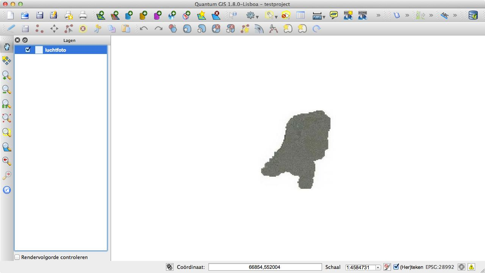
:::

De luchtfoto van Nederland is als *laag* toegevoegd. In QGIS kun je verschillende kaartlagen over elkaar leggen. Met de gebruikelijke knoppen voor inzoomen, uitzoomen en scrollen kun je de luchtfoto beter bestuderen (als die niet te zien zijn: Beeld > Werkbalken, kaartnavigatie aanvinken).

Via de PDOK website zijn zo allerlei lagen in te laden. Deze zijn te vinden onder Producten > PDOK Services > Overzicht URL's.

### Meer lagen ophalen vanaf PDOK met de plug-in
Voor PDOK is er een speciale plug-in voor QGIS. Ga naar *Plugins* in de menubalk en klik op *Python Plugins Ophalen…*. Wacht tot de plugins opgehaald zijn en typ vervolgens 'pdok' bij *Filter*. Klik op de PDOK services plugin zodat deze oplicht en klik vervolgens op *installeer plugin*. Na succesvolle installatie, klik op OK en Sluiten.

Ga opnieuw naar *Plugins* in de menubalk. Onderaan is nu *Pdok Services Plugin* verschenen. Ga hierheen en klik op *Pdok Services Plugin* in het verschenen menu.

Er verschijnt een lange lijst met honderden beschikbare kaartlagen! Er zijn verschillenden typen:

- WMS: Web Map Service. Dit is zogenaamde rasterdata; zoals ook de luchtfoto een plaatje is, zijn deze kaarten dat ook.
- WFS: Web Feature Service. Dit zijn geen plaatjes, maar *Features*. Deze features zijn bijvoorbeeld vlakken, lijnen of punten die in een GIS systeem te wijzigen zijn en waaraan je gegevens kan koppelen.
- WMTS: Web Map Tile Service. Kan niet ingelezen worden door QGIS 1.8
- TMS: Tile Map Service. Kan niet ingelezen worden door QGIS.

Er zijn verschillende kaartlagen beschikbaar, probeer bijvoorbeeld:

- *203 WFS Natura 2000*
De begrenzing van de Natura 2000 gebieden. Dit is een WFS laag waaraan extra informatie hangt. Selecteer 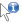 (Objecten identificeren) en klik op een Natura 2000 gebied om onder meer de naam van het gebied te weten te komen.
- *41 WMS Top10NL terreinen*
De vlakken van de topografische kaart, je moet misschien inzoomen om ze te kunnen zien.

## Objecten toevoegen

### Punten

#### Puntlaag toevoegen
Met QGIS kunnen ook lagen aangemaakt worden. Klik op 
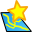 (Nieuwe Shape toevoegen). Er verschijnt een nieuw scherm met *Nieuwe vectorlaag*.

- Laat type op *punt* staan. 
- Klik op *Geef het CRS* en typ in de filter *RD New*. Klik op *Amersfoort/RD New* en klik op *OK*.
<small>CRS staat voor Coördinaat Referentie Systeem en bepaald hoe de kaart geprojecteerd wordt in welk coördinatensysteem. RD New is het gebruikelijke coördinatensysteem voor Nederland.</small>
- In *Nieuw attribuut* kun je velden aan de tabel toevoegen die straks zijn gekoppeld aan ieder punt in de laag. Vul nu *element* in bij naam en laat de andere opties staan (Tekstdata, breedte 80). Klik op *Toevoegen aan attributenlijst*. 
- Klik rechtsonder op *OK*.
- Sla het nieuwe Shape bestand op, op een locatie naar keuze. Bijvoorbeeld met als bestandsnaam *elementen*.

#### Punt toevoegen en bewaren
Om een *element* toe te voegen aan de laag *elementen* moet eerst bewerken aangezet worden. Klik 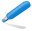 (Bewerken aan/uitzetten).
Klik op 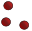 (Object toevoegen) en klik op een plek op de luchtfoto. Vul voor *element* een woord in, bijvoorbeeld *boom*, en klik op *OK*.
Voeg nog een ander punt toe met een andere naam voor het element.
Klik na het toevoegen van de elementen weer op  en sla de bewerking op.

### Polygonen of vlakken
Met QGIS kunnen ook vlakken en lijnen getekend worden. Als voorbeeld maken we een laag met vlakken met gegevens van een standaard bosbedrijfskaart.

#### Polygoonlaag toevoegen
Klik weer op .

- Verander type in *polygoon*. 
- Geef opnieuw *Amersfoort/RD New* als CRS op.
- Klik in de attributenlijst op ID en klik op *attribuut verwijderen*. 
- Voeg met *Nieuw attribuut* de volgende velden toe aan je tabel:

1. Naam: vak, type: Geheel getal
2. Naam: afdeling, type: Tekst-data, Breedte: 4
3. Naam: boomsoort, type: Tekst-data, Breedte: 4
4. Naam: kiemjaar, type: Geheel getal 

- Klik rechtsonder op *OK*.
- Sla het nieuwe Shape bestand op, op een locatie naar keuze. Bijvoorbeeld met als bestandsnaam *bedrijfskaart*.

#### Polygoon intekenen en bewaren
Om een *afdeling* toe te voegen aan de laag *bedrijfskaart* moet eerst weer bewerken aangezet worden. Markeer eerst de laag in de lijst met lagen links. Klik  (Bewerken aan/uitzetten).
Klik op 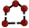 (Object toevoegen) en klik op een paar plekken op de luchtfoto. Vervolgens rechts klikken. Vul voor *vak* bijvoorbeeld '1' in, voor afdeling 'a', voor boomsoort 'ei' en voor kiemjaar '1933'. Klik OK. De eerste afdeling is getekend.

## Netjes intekenen (Snapping)
Om een tweede afdeling precies aan te laten sluiten bij het eerste kan *Snapping* aangezet worden op een laag.
Ga naar de menubalk en kies onder *Extra* voor *Snapping-opties*. Zet een vinkje voor de laag *bedrijfskaart*. Zet de *tolerantie* voor de bedrijfskaart op 10 en de *Eenheden* op *pixels*. Klik op *OK*.
Wanneer nu binnen 10 pixels van een bestaand hoekpunt van een vlak van de bedrijfskaart een nieuw hoekpunt wordt toegevoegd, springt dat hoekpunt automatisch naar de exacte locatie van het al bestaande hoekpunt.
Probeer naast het bestaande vlak van de afdeling maar eens een nieuwe afdeling te tekenen die precies aansluit.

## Kaartlaag opmaken
De vlakken en symbolen in een kaart zijn makkelijk op te maken. Open de *Laag Eigenschappen* door te dubbelklikken op *bedrijfskaart* aan de linkerkant onder Lagen. In het nieuwe venster (*Laag Eigenschappen*) is *Stijl* al geselecteerd. Verander *Enkel Symbool* in *Categorieën*. Selecteer *boomsoort* als *Kolom* en klik linksonder op *Classificeren*. Nu kan voor iedere boomsoort een andere kleur uitgekozen worden. Dubbelklik daarvoor op de regel van een boomsoort.
Kies voor de verschillende boomsoorten een opmaak en klik op *OK*

## Kaartlaag labelen
In *Laag Eigenschappen* kunnen ook labels aan een kaartlaag worden toegevoegd. Vink daarvoor *Toon labels* aan en selecteer een *Veld te gebruiken voor labels*. Klik op *OK*.

Uitgebreidere mogelijkheden om een kaartlaag te labelen zijn te vinden onder Labels 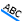. Hiermee kunnen meerder velden tegelijkertijd in een label worden meegenomen.
Eerst is het handig om de labeling in de *Laag Eigenschappen* weer uit te zetten, anders worden de labels straks over elkaar weergegeven.
Selecteer de laag bedrijfskaart door er op te klikken onder Lagen. Klik nu op . Vink *Deze laag labelen met* aan en klik op de knop met de drie puntjes (…). Kopieer en plak in het vakje *expressie* de volgende regel:

    "vak"  ||  "afdeling" || '\n'  ||  "boomsoort"    || ' ' ||    "kiemjaar" 

en klik op *OK*. Nu worden de vlakken gelabeld zoals in onderstaande schermafbeelding.

<small>Tussen de dubbele aanhalingstekens staan veldnamen (worden gevuld uit de tabel), de enkele aanhalingstekens zijn tekst en de '&#124;&#124;' zorgt ervoor dat die delen aan elkaar geplakt worden. '\n' zorgt voor een nieuwe regel.</small>

::: {.column-page}
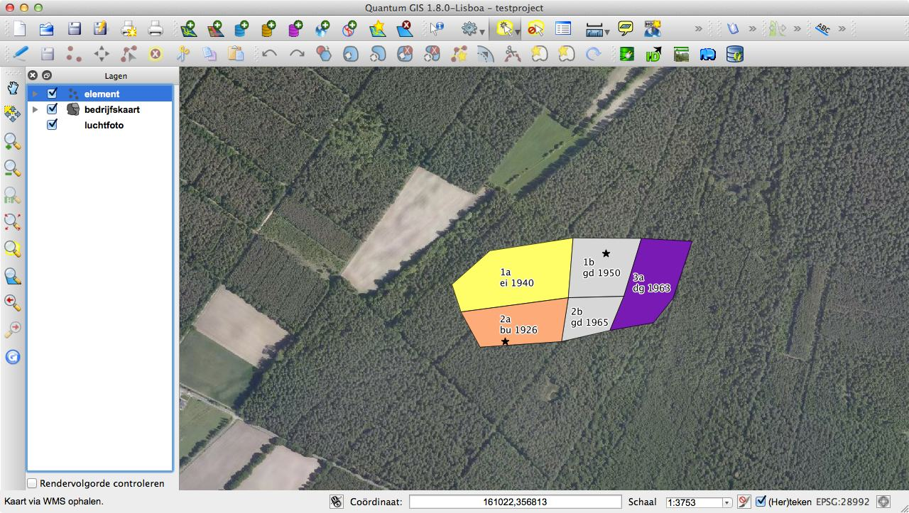
:::

## Oppervlaktes berekenen
Het is vaak handig om van de afdelingen ook de oppervlakte te weten. Die kan voor de vlakken in de laag bedrijfskaart berekend worden. Rechtsklik op de bedrijfskaart onder Lagen (inhoudsopgave). Selecteer 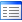 *Open attributentabel*.

Eerst maken we een nieuwe kolom aan. Klik in de *Attribuuttabel* op  en daarna op 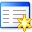.
Vul voor *naam* 'oppervlakte' in, selecteer bij *Type* *Decimaal getal (Real)* (een getal met cijfers achter de komma), voor *Breedte* 10 (max aantal tekens in het getal) en voor *Precisie* 2 (maximaal aantal getallen achter de komma).

Klik nu op . Vink bovenin het venster *Bestaande velden vernieuwen*. Selecteer daaronder de kolom *oppervlakte* die net is aangemaakt.
Vouw links in de *Functielijst* *Geometrie* open. Dubbelklik op de functie *$area*, zodat die onder *Expressie* verschijnt. Klik op *OK*.

Klik in de *Attribuuttabel* weer op  en bewaar de wijzigingen. In de kolom *oppervlakte* staan nu de oppervlaktes in vierkante meters (met 2 cijfers achter de komma).

## Gegevens exporten
Vaak is het handig om de tabel van een laag ook in bijvoorbeeld MS Excel te kunnen bekijken. Daarvoor kunnen de gegevens geëxporteerd worden naar een CSV bestand (komma gescheiden waarden). Rechtsklik daarvoor op een laag en kies *Opslaan Als…* . Verander *Formaat* in *Comma Separated Value*, kies een locatie om op te slaan (Opslaan Als, Bladeren…) en klik op *OK*. Het bestand dat wordt opgeslagen kan geopend worden in MS Excel, wel staan de verschillende waarden in Excel misschien nog in één kolom.

## Kaart afdrukken
Met QGIS kunnen kaarten uiteindelijk ook opgemaakt en geprint worden, of opgeslagen worden als pdf. 
In QGIS moet dan eerst onder de menubalk, via Bestand, een *Nieuw print Layouter* aangemaakt worden. Daar kan een kaart opgemaakt worden. Door  aan te klikken en vervolgens met de muis op het kaartvlak een vierkant te trekken kan een kaart toegevoegd worden op het 'papier'.
Probeer de mogelijkheden zelf verder uit.

## Project opslaan
Sla met 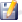 het QGIS-project op om er later mee verder te werken.

## En verder
Ik hoop dat dankzij dit verhaal duidelijk is geworden hoe goed open source GIS inmiddels is. Voor veel gebruikelijke toepassingen in bos- en natuurbeheer is dit programma zeker goed bruikbaar.

### Links met aanvullende informatie

- [Officiële handleiding QGIS 1.8](http://docs.qgis.org/1.8/html/nl/docs/user_manual/index.html "Officiële handleiding QGIS 1.8")
- [QGIS Nederland](http://www.qgis.nl/ "QGIS Nederland")
Nederlandse website over QGIS met tips en instucties.
- [Handleiding Quantum GIS 1.7.4](http://www.tragewegen.be/nl/professionals/bibliotheek/library/detail/detail/1468 "Handleiding Handleiding Quantum GIS")
Duidelijke en praktische Vlaamse handleiding van [tragewegen.be](http://www.tragewegen.be)"Tragewegen.be". Ook voor beginners met GIS.
- [The Free Quantum GIS Training Manual
Contents](http://manual.linfiniti.com/en/index.html "The Free Quantum GIS Training Manual
Contents") van [linfiniti.com](http://linfiniti.com "linfiniti.com")
- [NLextract](http://www.nlextract.nl/ "NLExtract")
NLExtract levert tools, recepten en voorbeelden om vrije Nederlandse (overheids-) geodata sets zoals BAG en Top10NL te converteren en te visualiseren. Niet echt voor beginners.
