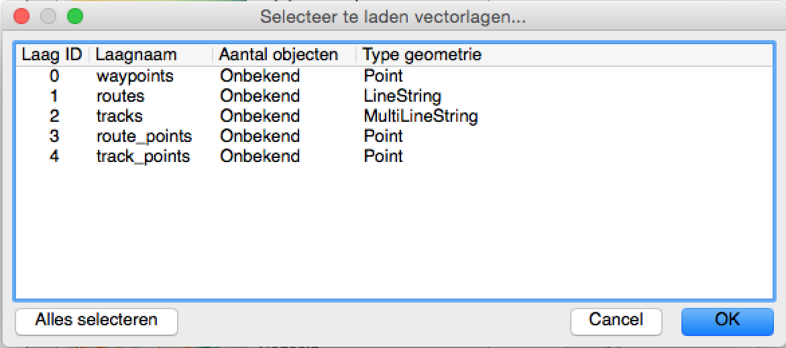
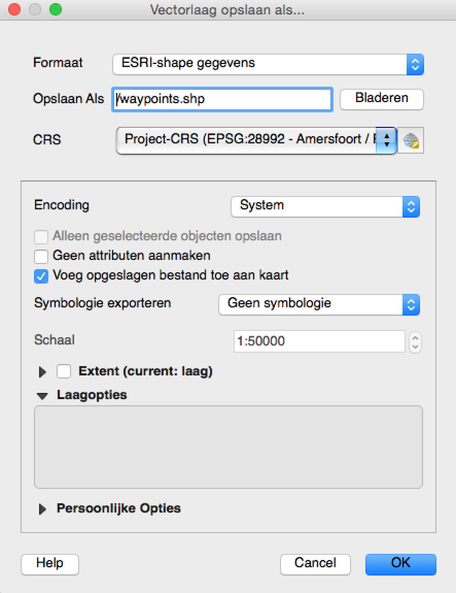

_Hoe krijg ik een GPS bestand in GIS_? Dat is één van de meest gestelde vragen die ik krijg met betrekking tot werken met GIS. Met QGIS is het erg gemakkelijk. Bij deze hoe je van een GPS bestand (.gpx) een standaard GIS bestand maakt (.shp). Onderstaande tekst lijkt lang, maar het is in praktijk zo gepiept.

## Stap 1: Installeer QGIS

Voor wie QGIS niet op de computer heeft: [QGIS](http://www.qgis.org/ "QGIS") is een gratis beschikbaar open-source GIS-programma. Download het programma voor jouw computer en installeer. Ik zou de laatste uitgave nemen als QGIS nieuw voor je is.

## Stap 2: Start QGIS (+ kies standaarprojectie).

Starten zal zeker lukken. 

Maar het is vaak ook handig om het Nederlandse coördinatiesysteem als standaard ingesteld te hebben. Dat is het Rijksdriehoeksstelsel. Ga naar **Extra>Opties...**. Vervolgens naar **CRS** (linker venster). Klik onder de kop **Standaard CRS voor nieuwe projecten** op het icoontje rechts naast de huidige geselecteerde CRS (EPSG:4326 - WGS 84). De bovenste invulbalk is een Filter, type daarin: 28992. Selecteer de enige optie in het venster er onder (Amersfoort / RD new - EPSG: 28992) en klik op OK. En weer op OK.

## Stap 3: Open het GPS bestand.

Het makkelijkst is een .gpx bestand te openen door het simpelweg in het venster van QGIS te slepen. Dan opent onderstaand nieuw venster.

{.full}

Selecteer in dit venster de lagen die in QGIS geladen moeten worden. Alle mogelijke lagen in een GPX bestand staan altijd in de lijst. Ook als ze niet in de betreffende GPX zitten. Meestal gaat het vooral om waypoints (opgenomen punten) en/of tracks (opgenomen lijnen). Onderstaande tabel geeft summier weer wat er in de lagen kan zitten.

Laagnaam     |                                  
------------ | ----------------------------------
waypoints    | Waypoints/Puntlaag uit de GPX     
routes       | Lijnen van een routes             
tracks       | Lijnen van tracks                 
route_points | Hoekpunten van routes             
track_points | Hoekpunten van tracks             

Klik op **OK** als de lagen geselecteerd zijn, vervolgens worden de gegevens zichtbaar in QGIS.

## Stap 4: Exporteren naar ander formaat

Nu zijn de gegevens alleen nog in te zien. Om ze ook te kunnen bewerken moeten ze worden opgeslagen in een meer gangbaar formaat voor GIS bewerking. De standaard voor gegevensuitwisseling is nog steeds het ESRI Shapefile formaat. QGIS werkt ook goed met dit bestandstype.

Rechts-klik op de laagnaam van de laag die je wil exporteren. Klik dan op **Opslaan als...**. Kies bij **Formaat** _ESRI-shape gegevens_. Kies bij **Opslaan Als** de locatie en de bestandsnaam. Controleer bij **CRS** welk coordinatiesysteem is geselecteerd. Een .gpx is altijd volgens het WGS84 geprojecteerd, maar meestal wil je het standaard landsysteem om in je GIS te werken. Ik kies EPSG 28992 - Amersfoort / RD New. Zie hieronder voor een voorbeeld.

{.full_smaller .no-caption}

Klik op **OK** om op te slaan.

Het nieuwe bestand is goed te bewerken en in te lezen met andere GIS applicaties. Let wel op een Shapefile bestaat uit meerdere afzonderlijke bestanden (minimaal een .shp, shx en .dbf. De .prj zou je bij delen ook moeten meeleveren, daarin staat welk coördinatiesysteem bij de gegevens hoort).

## Stap 5: Met achtergrondkaart bekijken.

Misschien handig om nog even een luchtfoto op de achtergrond te zetten?

De overheid heeft via [PDOK](http://www.pdok.nl) verschillende kaarten gratis beschikbaar gemaakt. Voor PDOK is er een speciale plug-in voor QGIS. Ga naar *Plugins* in de menubalk en klik op *Python Plugins Ophalen…*. Wacht tot de plugins opgehaald zijn en typ vervolgens 'pdok' bij *Filter*. Klik op de PDOK services plugin zodat deze oplicht en klik vervolgens op *installeer plugin*. Na succesvolle installatie, klik op OK en Sluiten.

Er verschijnen dan nieuwe icoontjes in de bovenbalk van QGIS. Klik op de nieuwe oranje knop met een plusje en PDOK er op. Kies in het nieuwe venster _PDOK-achtergrond luchtfoto_ en klik onderin **Laad deze laag in QGIS (of dubbelklik op de regel)**.

De luchtfoto wordt dan over internet ingeladen. De kaart wordt bovenop gelegd. Sleep de nieuwe laagnaam _PDOK-achtergrond luchtfoto_ zodat die onder de ingelezen GPS lagen staat.

_Succes met werken met GIS en GPS bestanden!_

